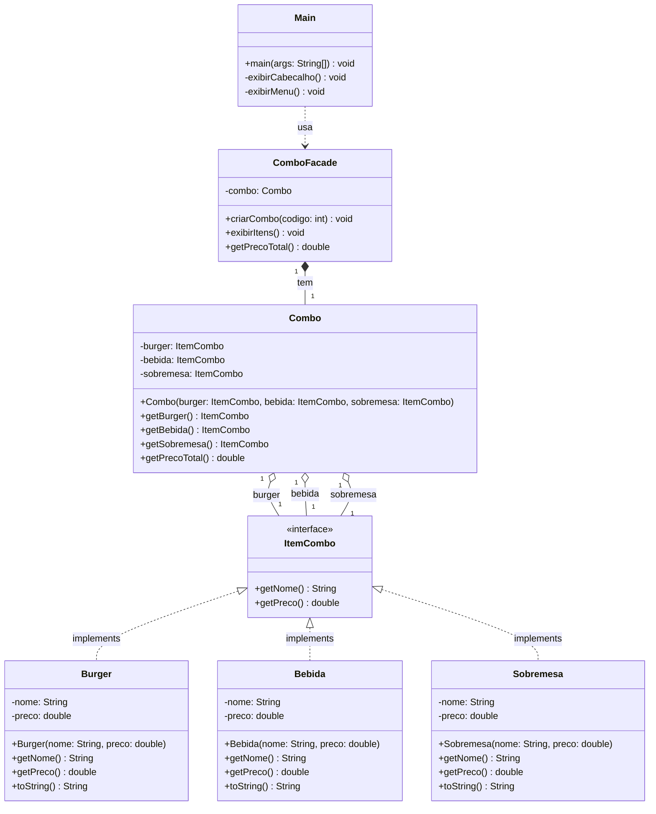

# Design Pattern Facade

---

## Sumário

1. [Revisão: Design Patterns](#1-revisão-design-patterns)
2. [O Pattern Facade](#2-o-pattern-facade)
3. [Comparação com Outros Patterns](#3-comparação-com-outros-patterns)
4. [Implementação em Java](#4-implementação-em-java)
5. [Atividade Prática](#5-atividade-prática)
6. [Dicas de Implementação](#6-dicas-de-implementação)
7. [Entrega](#7-entrega)
8. [Referências Complementares](#8-referências-complementares)

---

## 1. Revisão: Design Patterns

### Relembrando os Conceitos

Na aula anterior, estudamos o padrão **Singleton**, um padrão **criacional** que controla a instanciação de objetos. Agora, vamos explorar o **Facade**, um padrão **estrutural** que trata da composição e organização de classes e objetos.

### Classificação por Propósito

Relembrando a classificação dos 23 padrões do GoF:

- **Padrões Criacionais**: Como criar objetos (ex: Singleton, Factory, Builder)
- **Padrões Estruturais**: Como compor objetos e classes (ex: **Facade**, Adapter, Decorator)
- **Padrões Comportamentais**: Como objetos interagem (ex: Strategy, Observer, Command)

---

## 2. O Pattern Facade

### Definição

O padrão **Facade** (Fachada) é um padrão estrutural que fornece uma **interface simplificada** para um subsistema complexo. Ele atua como uma "fachada" que esconde a complexidade interna, oferecendo ao cliente um ponto de acesso unificado e fácil de usar.

> **Analogia do Mundo Real**: Pense em uma central de atendimento de uma empresa. Você liga para **um único número** e o atendente resolve seu problema, mesmo que internamente ele precise acionar múltiplos departamentos (financeiro, técnico, logística). Você não precisa conhecer a estrutura interna da empresa.

### Quando usar?

Use o Facade quando:

- Um sistema é muito **complexo** ou difícil de entender
- Você deseja **reduzir dependências** entre o código cliente e subsistemas
- Precisa de um **ponto de entrada único** para um conjunto de interfaces
- Quer **organizar** um sistema em camadas (cada camada pode ter um facade)
- Deseja **simplificar** a interface para casos de uso comuns

### Exemplos de Uso Real

1. **Biblioteca de Compilação**
   - Cliente chama: `Compilador.compilar("MeuPrograma.java")`
   - Internamente: lexer → parser → analisador semântico → gerador de código

2. **Sistema Bancário**
   - Cliente chama: `Banco.transferir(origem, destino, valor)`
   - Internamente: validação de saldo → registro de transação → atualização de contas → notificação

3. **Framework de Pedidos (Nossa Atividade)**
   - Cliente chama: `ComboFacade.criarCombo(1)`
   - Internamente: cria burger → cria bebida → cria sobremesa → monta combo

4. **Conversão de Formatos**
   - Cliente chama: `ConversorVideo.converter("video.avi", "video.mp4")`
   - Internamente: decodificação → processamento → recodificação → salvamento

5. **Home Theater**
   - Cliente chama: `HomeTheater.assistirFilme("Matrix")`
   - Internamente: ligar amplificador → ajustar volume → ligar DVD → baixar tela → escurecer luzes

### Estrutura

```
┌─────────────┐
│   Cliente   │
└──────┬──────┘
       │ usa
       ▼
┌─────────────────────┐
│      Facade         │
│                     │
│ +operacaoSimples()  │
└──────┬──────────────┘
       │ coordena
       ▼
┌─────────────────────────────────────┐
│                                     │
│  ┌─────────────┐  ┌─────────────┐   │
│  │ Subsistema1 │  │ Subsistema2 │   │
│  └─────────────┘  └─────────────┘   │
│                                     │
│  ┌─────────────┐  ┌─────────────┐   │
│  │ Subsistema3 │  │ Subsistema4 │   │
│  └─────────────┘  └─────────────┘   │
│                                     │
└─────────────────────────────────────┘
         Subsistema Complexo
```

### Participantes

- **Facade**: Classe que conhece quais subsistemas são responsáveis por cada requisição e delega as chamadas apropriadas
- **Subsistemas**: Implementam funcionalidades específicas mas não conhecem o Facade
- **Cliente**: Usa o Facade ao invés de interagir diretamente com os subsistemas

### Vantagens

✅ **Simplicidade**: Interface mais fácil de usar e entender  
✅ **Desacoplamento**: Isola clientes da complexidade do subsistema  
✅ **Manutenibilidade**: Mudanças internas não afetam clientes  
✅ **Testabilidade**: Facilita testes mockando o facade  
✅ **Organização**: Promove divisão em camadas  

### Desvantagens

❌ Pode se tornar um "objeto deus" se acumular muitas responsabilidades  
❌ Pode adicionar uma camada desnecessária se o subsistema já é simples  
❌ Pode limitar acesso a funcionalidades avançadas dos subsistemas  

### Diferença entre Facade e Outros Patterns

| Pattern | Propósito | Diferença Principal |
|---------|-----------|---------------------|
| **Adapter** | Converter interfaces incompatíveis | Adapter **adapta**, Facade **simplifica** |
| **Mediator** | Reduzir comunicação entre objetos | Mediator coordena **interações**, Facade **unifica acesso** |
| **Proxy** | Controlar acesso a um objeto | Proxy tem a **mesma interface**, Facade tem interface **simplificada** |

---

## 3. Comparação com Outros Patterns

### Facade vs Singleton

| Aspecto | Singleton | Facade |
|---------|-----------|--------|
| **Tipo** | Criacional | Estrutural |
| **Foco** | Controlar instanciação | Simplificar interface |
| **Instâncias** | Sempre uma única | Pode ter múltiplas |
| **Uso Conjunto** | ✅ Facade pode SER um Singleton | |

**Exemplo de uso conjunto:**
```java
public class ComboFacade {
    private static ComboFacade instance; // Singleton
    
    private ComboFacade() {}
    
    public static ComboFacade getInstance() {
        if (instance == null) {
            instance = new ComboFacade();
        }
        return instance;
    }
    
    public Combo criarCombo(int codigo) {
        // Facade simplificando criação
    }
}
```

---

## 4. Implementação em Java

### Exemplo Simples: Sistema de Home Theater

#### Subsistemas Complexos

```java
// Subsistema 1: Amplificador
public class Amplificador {
    public void ligar() {
        System.out.println("Amplificador ligado");
    }
    
    public void ajustarVolume(int nivel) {
        System.out.println("Volume ajustado para " + nivel);
    }
    
    public void desligar() {
        System.out.println("Amplificador desligado");
    }
}

// Subsistema 2: DVD Player
public class DvdPlayer {
    public void ligar() {
        System.out.println("DVD Player ligado");
    }
    
    public void inserirDvd(String filme) {
        System.out.println("Inserindo DVD: " + filme);
    }
    
    public void play() {
        System.out.println("Reproduzindo filme");
    }
    
    public void stop() {
        System.out.println("Filme parado");
    }
    
    public void desligar() {
        System.out.println("DVD Player desligado");
    }
}

// Subsistema 3: Projetor
public class Projetor {
    public void ligar() {
        System.out.println("Projetor ligado");
    }
    
    public void modoWideScreen() {
        System.out.println("Modo widescreen ativado");
    }
    
    public void desligar() {
        System.out.println("Projetor desligado");
    }
}

// Subsistema 4: Luzes
public class Luzes {
    public void escurecer(int nivel) {
        System.out.println("Luzes ajustadas para " + nivel + "%");
    }
}
```

#### Facade Simplificador

```java
public class HomeTheaterFacade {
    private Amplificador amp;
    private DvdPlayer dvd;
    private Projetor projetor;
    private Luzes luzes;
    
    public HomeTheaterFacade(Amplificador amp, DvdPlayer dvd, 
                             Projetor projetor, Luzes luzes) {
        this.amp = amp;
        this.dvd = dvd;
        this.projetor = projetor;
        this.luzes = luzes;
    }
    
    // Método simples que esconde toda a complexidade
    public void assistirFilme(String filme) {
        System.out.println("\n=== Preparando para assistir filme ===");
        luzes.escurecer(10);
        projetor.ligar();
        projetor.modoWideScreen();
        amp.ligar();
        amp.ajustarVolume(5);
        dvd.ligar();
        dvd.inserirDvd(filme);
        dvd.play();
        System.out.println("=== Aproveite o filme! ===\n");
    }
    
    public void finalizarFilme() {
        System.out.println("\n=== Finalizando sessão ===");
        dvd.stop();
        dvd.desligar();
        amp.desligar();
        projetor.desligar();
        luzes.escurecer(100);
        System.out.println("=== Sistema desligado ===\n");
    }
}
```

#### Cliente

```java
public class TesteHomeTheater {
    public static void main(String[] args) {
        // Sem Facade - Cliente precisa conhecer tudo
        System.out.println("SEM FACADE:");
        Amplificador amp = new Amplificador();
        DvdPlayer dvd = new DvdPlayer();
        Projetor proj = new Projetor();
        Luzes luzes = new Luzes();
        
        // Muitas chamadas!
        luzes.escurecer(10);
        proj.ligar();
        proj.modoWideScreen();
        amp.ligar();
        amp.ajustarVolume(5);
        dvd.ligar();
        dvd.inserirDvd("Matrix");
        dvd.play();
        
        System.out.println("\n" + "=".repeat(40) + "\n");
        
        // Com Facade - Simplicidade
        System.out.println("COM FACADE:");
        HomeTheaterFacade homeTheater = new HomeTheaterFacade(amp, dvd, proj, luzes);
        
        // Uma única chamada!
        homeTheater.assistirFilme("Matrix");
        
        // Pause...
        
        homeTheater.finalizarFilme();
    }
}
```

---

## 5. Atividade Prática

### Contexto do Problema

Você foi contratado para desenvolver um sistema simplificado de pedidos para uma **lanchonete de fast-food**. O sistema deve permitir que clientes façam pedidos de combos usando apenas um número (estilo "peça pelo número").

#### Desafio

Cada combo contém **três itens**:
- 1 sanduíche (burger)
- 1 bebida
- 1 sobremesa

O cliente informa apenas o **código do combo**, e o sistema deve:
1. Criar automaticamente todos os itens correspondentes
2. Calcular o preço total
3. Exibir os detalhes do pedido

### Requisitos Funcionais

| ID | Requisito | Descrição |
|----|-----------|-----------|
| **RF1** | Criar interface `ItemCombo` | Deve conter `getNome()` e `getPreco()` |
| **RF2** | Implementar entidades concretas | Classes `Burger`, `Bebida`, `Sobremesa` implementam `ItemCombo` |
| **RF3** | Criar classe `Combo` | Agrega os três tipos de itens |
| **RF4** | Implementar `ComboFacade` | Método `criarCombo(int codigo)` retorna `Combo` montado |
| **RF5** | Exibir itens do combo | Método `exibirItens()` imprime nome e preço de cada item |
| **RF6** | Calcular total | Método `getPrecoTotal()` soma preços dos itens |
| **RF7** | Interface de usuário | Menu console que permite escolher combo |
| **RF8** | Validação | Tratar código de combo inválido |

### Requisitos Não-Funcionais

- **RNF1**: Código em Java (versão 8 ou superior)
- **RNF2**: Interface console (sem GUI)
- **RNF3**: Seguir convenções Java (camelCase, nomenclatura clara)
- **RNF4**: Organizar código em pacotes lógicos
- **RNF5**: Baixo acoplamento usando interfaces

### Diagrama UML Completo



---

### Estrutura de Pacotes Recomendada

```
br.fastfood/
├── app/
│   └── Main.java              # Ponto de entrada
├── facade/
│   └── ComboFacade.java       # Facade principal
└── model/
    ├── ItemCombo.java         # Interface
    ├── Burger.java            # Implementação
    ├── Bebida.java            # Implementação
    ├── Sobremesa.java         # Implementação
    └── Combo.java             # Agregador
```

### Especificação dos Combos

| Código | Nome | Burger | Bebida | Sobremesa | Preço |
|--------|------|--------|--------|-----------|-------|
| 1 | Combo Master | Big Cheddar | Coca-Cola | Sundae | R$ 35,90 |
| 2 | Super Combo | Mega Bacon | Guaraná | Torta de Maçã | R$ 32,50 |
| 3 | Combo Kids | Mini Burger | Suco Laranja | Sorvete | R$ 22,90 |

### Templates de Código

#### Interface ItemCombo

```java
package br.fastfood.model;

public interface ItemCombo {
    String getNome();
    double getPreco();
}
```

#### Classe Burger (Exemplo Completo)

```java
package br.fastfood.model;

public class Burger implements ItemCombo {
    private final String nome;
    private final double preco;
    
    public Burger(String nome, double preco) {
        this.nome = nome;
        this.preco = preco;
    }
    
    @Override
    public String getNome() {
        return nome;
    }
    
    @Override
    public double getPreco() {
        return preco;
    }
    
    @Override
    public String toString() {
        return String.format("%s (R$ %.2f)", nome, preco);
    }
}
```

#### Classe Bebida (Template para Implementar)

```java
package br.fastfood.model;

public class Bebida implements ItemCombo {
    // TODO: Declare os atributos necessários
    
    // TODO: Implemente o construtor
    
    // TODO: Implemente getNome()
    
    // TODO: Implemente getPreco()
    
    // TODO: Sobrescreva toString() para formatação adequada
}
```

#### Classe Sobremesa (Template para Implementar)

```java
package br.fastfood.model;

public class Sobremesa implements ItemCombo {
    // TODO: Declare os atributos necessários
    
    // TODO: Implemente o construtor
    
    // TODO: Implemente getNome()
    
    // TODO: Implemente getPreco()
    
    // TODO: Sobrescreva toString() para formatação adequada
}
```

#### Classe Combo

```java
package br.fastfood.model;

public class Combo {
    private ItemCombo burger;
    private ItemCombo bebida;
    private ItemCombo sobremesa;
    
    public Combo(ItemCombo burger, ItemCombo bebida, ItemCombo sobremesa) {
        this.burger = burger;
        this.bebida = bebida;
        this.sobremesa = sobremesa;
    }
    
    public ItemCombo getBurger() {
        return burger;
    }
    
    public ItemCombo getBebida() {
        return bebida;
    }
    
    public ItemCombo getSobremesa() {
        return sobremesa;
    }
    
    public double getPrecoTotal() {
        // TODO: Calcule e retorne a soma dos preços dos três itens
        return 0.0; // SUBSTITUIR
    }
}
```

#### Classe ComboFacade (Template Principal)

```java
package br.fastfood.facade;

import br.fastfood.model.*;

public class ComboFacade {
    private Combo combo;
    
    /**
     * Cria um combo baseado no código fornecido
     * @param codigo número do combo (1, 2 ou 3)
     */
    public void criarCombo(int codigo) {
        switch (codigo) {
            case 1:
                // TODO: Criar Combo Master
                // Big Cheddar (R$ 18.00) + Coca-Cola (R$ 8.00) + Sundae (R$ 9.90)
                break;
            case 2:
                // TODO: Criar Super Combo
                // Mega Bacon (R$ 16.00) + Guaraná (R$ 7.50) + Torta de Maçã (R$ 9.00)
                break;
            case 3:
                // TODO: Criar Combo Kids
                // Mini Burger (R$ 12.00) + Suco Laranja (R$ 6.00) + Sorvete (R$ 4.90)
                break;
            default:
                System.out.println("Código de combo inválido!");
                break;
        }
    }
    
    /**
     * Exibe todos os itens do combo
     */
    public void exibirItens() {
        if (combo == null) {
            System.out.println("Nenhum combo criado ainda!");
            return;
        }
        
        System.out.println("\n=== Detalhes do Pedido ===");
        // TODO: Exibir burger
        // TODO: Exibir bebida
        // TODO: Exibir sobremesa
        System.out.println("==========================");
    }
    
    /**
     * Retorna o preço total do combo
     * @return preço total
     */
    public double getPrecoTotal() {
        // TODO: Retornar o preço total do combo
        // Dica: use combo.getPrecoTotal()
        return 0.0; // SUBSTITUIR
    }
}
```

#### Classe Main (Cliente)

```java
package br.fastfood.app;

import java.util.Scanner;
import br.fastfood.facade.ComboFacade;

public class Main {
    public static void main(String[] args) {
        Scanner scanner = new Scanner(System.in);
        
        System.out.println("╔════════════════════════════════╗");
        System.out.println("║   LANCHONETE FAST-FOOD        ║");
        System.out.println("╚════════════════════════════════╝");
        System.out.println("\n=== MENU DE COMBOS ===");
        System.out.println("1 – Combo Master    (R$ 35,90)");
        System.out.println("2 – Super Combo     (R$ 32,50)");
        System.out.println("3 – Combo Kids      (R$ 22,90)");
        System.out.println("0 – Sair");
        
        boolean continuar = true;
        ComboFacade facade = new ComboFacade();
        
        while (continuar) {
            System.out.print("\nSua escolha: ");
            int escolha = scanner.nextInt();
            
            if (escolha == 0) {
                System.out.println("Obrigado pela preferência!");
                continuar = false;
            } else if (escolha >= 1 && escolha <= 3) {
                facade.criarCombo(escolha);
                facade.exibirItens();
                System.out.printf("\n💰 Total a pagar: R$ %.2f\n", 
                                facade.getPrecoTotal());
            } else {
                System.out.println("❌ Opção inválida!");
            }
        }
        
        scanner.close();
    }
}
```

### Perguntas para Reflexão

Após completar a implementação, responda:

1. **Qual é o papel do ComboFacade neste sistema?**
   - Como ele simplifica a vida do cliente (Main)?

2. **Por que usamos a interface ItemCombo?**
   - Que benefícios isso traz para o design?

3. **Compare com o padrão Singleton:**
   - Poderia o ComboFacade também ser um Singleton? Por quê?
   - Em que situação isso seria útil?

4. **Identifique os subsistemas:**
   - Quais são as classes que representam a "complexidade" escondida?
   - O que aconteceria se o cliente (Main) tivesse que criar cada item individualmente?

5. **Extensibilidade:**
   - Como você adicionaria um novo combo (Combo 4) ao sistema?
   - Que classes precisariam ser modificadas?

6. **Validação e Tratamento de Erros:**
   - Como o sistema trata um código de combo inválido?
   - Que melhorias você sugere?

---

## 6. Dicas de Implementação

### 🎯 Dica 1: Comece pela Interface

Sempre implemente a interface primeiro. Ela define o "contrato" que todas as classes devem seguir.

```java
// CORRETO: Definir a interface primeiro
public interface ItemCombo {
    String getNome();
    double getPreco();
}

// DEPOIS implementar as classes
public class Burger implements ItemCombo { ... }
```

### 🎯 Dica 2: Use `final` para Imutabilidade

Torne os atributos `final` quando eles não devem mudar após a criação:

```java
public class Burger implements ItemCombo {
    private final String nome;    // ✅ Não pode ser modificado
    private final double preco;   // ✅ Não pode ser modificado
    
    public Burger(String nome, double preco) {
        this.nome = nome;
        this.preco = preco;
    }
}
```

### 🎯 Dica 3: Sobrescreva `toString()` para Debugging

Facilita a visualização de objetos durante o desenvolvimento:

```java
@Override
public String toString() {
    return String.format("%s (R$ %.2f)", nome, preco);
}

// Uso:
System.out.println(burger);  // Output: Big Cheddar (R$ 18.00)
```

### 🎯 Dica 4: Valide Entradas no Facade

O facade deve proteger o sistema de entradas inválidas:

```java
public void criarCombo(int codigo) {
    if (codigo < 1 || codigo > 3) {
        System.out.println("❌ Código inválido! Use 1, 2 ou 3.");
        return;
    }
    
    switch (codigo) {
        // ... casos válidos
    }
}
```

### 🎯 Dica 5: Evite Duplicação de Código

Se você está copiando e colando, provavelmente há uma forma melhor:

```java
// ❌ RUIM: Código duplicado
public void exibirItens() {
    System.out.println("Burger: " + combo.getBurger().getNome() + 
                       " - R$ " + combo.getBurger().getPreco());
    System.out.println("Bebida: " + combo.getBebida().getNome() + 
                       " - R$ " + combo.getBebida().getPreco());
    System.out.println("Sobremesa: " + combo.getSobremesa().getNome() + 
                       " - R$ " + combo.getSobremesa().getPreco());
}

// ✅ BOM: Método auxiliar
public void exibirItens() {
    exibirItem("Burger", combo.getBurger());
    exibirItem("Bebida", combo.getBebida());
    exibirItem("Sobremesa", combo.getSobremesa());
}

private void exibirItem(String tipo, ItemCombo item) {
    System.out.printf("%-12s: %s - R$ %.2f%n", 
                      tipo, item.getNome(), item.getPreco());
}
```

### 🎯 Dica 6: Teste Cada Classe Individualmente

Crie classes de teste simples antes de integrar tudo:

```java
// TesteBurger.java
public class TesteBurger {
    public static void main(String[] args) {
        Burger b = new Burger("Big Cheddar", 18.00);
        System.out.println("Nome: " + b.getNome());
        System.out.println("Preço: " + b.getPreco());
        System.out.println("ToString: " + b);
    }
}
```

### 🎯 Dica 7: Organize Imports e Pacotes

Mantenha os imports organizados e use a estrutura de pacotes corretamente:

```java
// ✅ BOM: Imports específicos, em ordem alfabética
package br.fastfood.facade;

import br.fastfood.model.Bebida;
import br.fastfood.model.Burger;
import br.fastfood.model.Combo;
import br.fastfood.model.Sobremesa;

// ❌ EVITAR: Import genérico (só use se realmente precisar de muitas classes)
import br.fastfood.model.*;
```

### 🎯 Dica 8: Documentação com JavaDoc

Adicione comentários JavaDoc para métodos públicos:

```java
/**
 * Cria um combo baseado no código fornecido.
 * 
 * @param codigo o código do combo (1=Master, 2=Super, 3=Kids)
 * @throws IllegalArgumentException se o código for inválido
 */
public void criarCombo(int codigo) {
    // implementação
}
```

### 🎯 Dica 9: Formatação de Preços

Use `String.format()` ou `System.out.printf()` para formatar valores monetários:

```java
// ✅ BOM: Formatação adequada
System.out.printf("Total: R$ %.2f%n", preco);  // Output: Total: R$ 35.90

// ❌ EVITAR: Sem formatação
System.out.println("Total: R$ " + preco);      // Output: Total: R$ 35.9
```

### 🎯 Dica 10: Trate Casos Especiais

Sempre verifique se objetos estão nulos antes de usá-los:

```java
public void exibirItens() {
    if (combo == null) {
        System.out.println("⚠️  Nenhum combo criado ainda!");
        return;
    }
    
    // Continua com a exibição...
}
```

### 🎯 Dica 11: Melhore a Experiência do Usuário

Adicione emojis e formatação visual no console:

```java
System.out.println("╔════════════════════════════════╗");
System.out.println("║   LANCHONETE FAST-FOOD        ║");
System.out.println("╚════════════════════════════════╝");
System.out.println("🍔 Burger    : " + combo.getBurger().getNome());
System.out.println("🥤 Bebida    : " + combo.getBebida().getNome());
System.out.println("🍰 Sobremesa : " + combo.getSobremesa().getNome());
System.out.println("💰 TOTAL     : R$ " + getPrecoTotal());
```

### 🎯 Dica 12: Checklist de Implementação

Use este checklist para não esquecer nada:

- [ ] Interface `ItemCombo` criada
- [ ] Classe `Burger` implementada e testada
- [ ] Classe `Bebida` implementada e testada
- [ ] Classe `Sobremesa` implementada e testada
- [ ] Classe `Combo` criada
- [ ] Método `getPrecoTotal()` do Combo implementado
- [ ] Classe `ComboFacade` criada
- [ ] Método `criarCombo()` com todos os 3 combos
- [ ] Método `exibirItens()` implementado
- [ ] Método `getPrecoTotal()` do Facade implementado
- [ ] Validação de código inválido funcionando
- [ ] Classe `Main` com menu interativo
- [ ] Tratamento de entrada do usuário
- [ ] Código compilando sem erros
- [ ] Código organizado em pacotes corretos
- [ ] Testes manuais realizados

---

## 7. Entrega

Voce deve submeter via TEAMS :

1. A url de um repositório publico contendo a sua implementação* 
2. Arquivo com as respostas para as perguntas de reflexâo


## 8. Referências Complementares

### Livros

1. **Gamma, E., et al.** (1994). *Design Patterns: Elements of Reusable Object-Oriented Software*. Addison-Wesley.
   - Capítulo sobre Facade (p. 185-193)

2. **Freeman, E., Robson, E.** (2004). *Head First Design Patterns*. O'Reilly.
   - Capítulo 7: "The Facade Pattern - Simplifying Interfaces"

3. **Shalloway, A., Trott, J.R.** (2004). *Design Patterns Explained*. Addison-Wesley.
   - Explicação didática do Facade

4. **Bloch, J.** (2018). *Effective Java* (3rd Edition). Addison-Wesley.
   - Item 1: "Consider static factory methods instead of constructors"

### Artigos e Tutoriais

5. **Refactoring.Guru - Facade Pattern**
   - URL: https://refactoring.guru/design-patterns/facade
   - Tutorial interativo com exemplos

6. **SourceMaking - Facade Design Pattern**
   - URL: https://sourcemaking.com/design_patterns/facade
   - Diagramas UML e exemplos práticos

7. **Baeldung - Introduction to the Facade Pattern**
   - URL: https://www.baeldung.com/java-facade-pattern
   - Implementação em Java com exemplos

8. **Java Design Patterns - Facade**
   - URL: https://java-design-patterns.com/patterns/facade/
   - Código-fonte completo disponível

### Vídeos

9. **Christopher Okhravi - Facade Pattern**
   - YouTube: Design Patterns Video Tutorial
   - Explicação clara com exemplos práticos

10. **Derek Banas - Facade Design Pattern Tutorial**
    - YouTube: Design Patterns Tutorial
    - Implementação passo a passo

### Comparações e Artigos Avançados

11. **Facade vs Adapter vs Mediator**
    - URL: https://stackoverflow.com/questions/350404
    - Discussão sobre diferenças entre patterns similares

12. **When to Use Facade Pattern**
    - URL: https://www.dofactory.com/net/facade-design-pattern
    - Cenários práticos de aplicação

### Repositórios de Exemplo

13. **iluwatar/java-design-patterns**
    - URL: https://github.com/iluwatar/java-design-patterns
    - Implementações de referência

14. **kamranahmedse/design-patterns-for-humans**
    - URL: https://github.com/kamranahmedse/design-patterns-for-humans
    - Explicações ultra-simplificadas

### Documentação Oficial

15. **Oracle Java Tutorials**
    - URL: https://docs.oracle.com/javase/tutorial/
    - Fundamentos da linguagem Java

16. **Java Code Conventions**
    - URL: https://www.oracle.com/java/technologies/javase/codeconventions
    - Padrões de código Java

### Ferramentas Úteis

17. **PlantUML**
    - URL: https://plantuml.com/
    - Criar diagramas UML a partir de texto

18. **IntelliJ IDEA Community**
    - URL: https://www.jetbrains.com/idea/
    - IDE gratuita para Java

19. **Visual Studio Code + Java Extension Pack**
    - Alternativa leve para desenvolvimento Java

---

## Licença

Este material é disponibilizado para fins educacionais.

**Autor:** Prof. Ms. Claudio Souza Nunes  

---

## Contribuições

Encontrou algum erro ou tem sugestões? Entre em contato ou abra uma issue no repositório.

---

**Bons estudos e bom código! 🚀**
